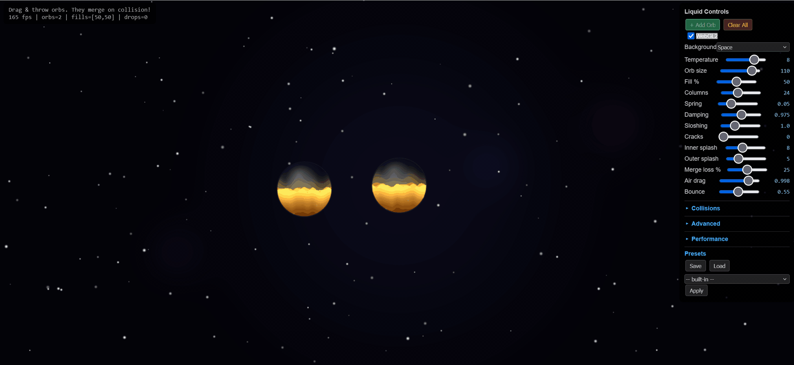
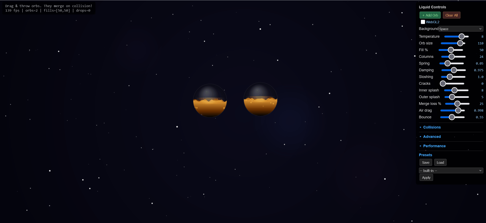

# liquid-orb-editor

**Интерактивный редактор физики жидкого шара** на Canvas 2D и WebGL 2.
Single-file HTML · zero dependencies · MIT



Живая песочница для тонкой настройки симуляции жидкости внутри сферического объёма: волны на поверхности, гравитация, сплэши, вязкость, инерция при наклоне. Настройки применяются сразу — видишь результат. Два режима рендера — Canvas 2D (проще, универсальный) и WebGL 2 (больше эффектов: блики, каустики, ray-marching).

Используется как инструмент при разработке [**lava-orb**](https://github.com/andromanpro/lava-orb) — оттачивает параметры жидкости, которые потом копируются в основную библиотеку.

---

## Что внутри

- 🌊 **Физика волн** — колонный spring-damper с настраиваемыми `cols / stiffness / damping`
- 💧 **Inner splashes** — капли внутри орба при ударе жидкости о стенку
- 🌀 **Гравитация и tilt** — орб наклоняется при drag'е, жидкость следует
- 🖼️ **Backgrounds** — Ocean, Space, Abstract (те же, что и в [shared-backgrounds](https://github.com/andromanpro/shared-backgrounds))
- 🎨 **Live tweaking** — все параметры настраиваются через UI-панель
- 📦 **Export JSON** — сохранить пресет для использования в другом проекте

## Два режима рендера

| | Canvas 2D | WebGL 2 |
|---|---|---|
| **Скорость** | быстрый на слабом железе | быстрый на GPU, тормозит на SSD |
| **Эффекты** | spline-surface, прозрачность | + каустики, блики, ray-marched спекулярные |
| **Поддержка** | везде | современные браузеры |


*Canvas 2D режим — два орба с разными параметрами. Жидкость реагирует на drag, колонки волн независимы.*

---

## Запуск

Редактор — одностраничное приложение. Не требует сборки.

```bash
# Клонировать и запустить локальный сервер
git clone https://github.com/andromanpro/liquid-orb-editor
cd liquid-orb-editor
python -m http.server 8878
# → http://localhost:8878/
```

Или просто открыть `index.html` через локальный сервер (через `file://` WebGL 2 не работает).

---

## Использование

1. Открой редактор → по клику на кнопку **+** добавляются новые орбы
2. Тяни орб мышью — жидкость наклоняется, с инерцией возвращается
3. В правой панели — все параметры физики. Подвигай слайдеры, посмотри эффект
4. **Save preset** → скачивает JSON с текущей конфигурацией
5. **Load preset** → применяет сохранённую конфигурацию

## Параметры (основные)

| Параметр | Что делает |
|---|---|
| `cols` | количество столбцов волновой симуляции (больше = детальнее волна, дороже) |
| `stiffness` | упругость пружины возврата (высокое → волна быстро затухает) |
| `damping` | гашение колебаний (высокое → меньше остаточных волн) |
| `sloshing` | усилие, передаваемое от drag'а жидкости |
| `gravity` | скорость возврата tilt к нулю |
| `innerSplash` | триггер капель при ударе столба о стенку |
| `surfaceGlow` | WebGL-режим: подсветка поверхности снизу |

---

## Связанные проекты

- [**lava-orb**](https://github.com/andromanpro/lava-orb) — основная библиотека, использует найденные здесь параметры
- [**fire-particle-editor**](https://github.com/andromanpro/fire-particle-editor) — аналогичный редактор для пламени
- [**shared-backgrounds**](https://github.com/andromanpro/shared-backgrounds) — WebGL2-фоны (Ocean/Space/Abstract отсюда вытащены туда)

---

## Лицензия

[MIT](LICENSE) © 2026 andromanpro

---

## English

> **Interactive editor for liquid-orb physics.** Canvas 2D + WebGL 2, single-file HTML, zero dependencies, MIT.

Live sandbox for tweaking liquid simulation inside a sphere — waves, gravity, splashes, viscosity, tilt inertia. Canvas 2D and WebGL 2 renderers. Used during the development of [**lava-orb**](https://github.com/andromanpro/lava-orb) to tune the fluid parameters that are later ported to the main library.

### Run

```bash
git clone https://github.com/andromanpro/liquid-orb-editor
cd liquid-orb-editor
python -m http.server 8878
# → http://localhost:8878/
```

Open in browser, drag orbs, tweak sliders in the right panel, export JSON presets.
